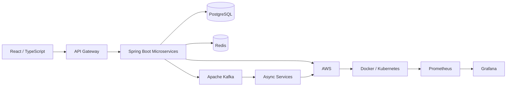

<div align="center">

# 👋 Hi, I'm Jyoti Ranjan Kalta

### Java Backend & Full-Stack Engineer | 5+ Years Experience

**Building scalable • distributed • cloud-native applications**

<br/>


</div>

---

## 👨‍💻 About Me

```java
public class JyotiRanjanKalta {

    String role = "Software Engineer";
    String experience = "5+ Years";

    String[] backend = {
        "Java", "Spring Boot", "Microservices",
        "JPA", "Hibernate", "Kafka"
    };

    String[] cloud = {
        "AWS", "Docker", "Kubernetes",
        "Terraform", "Ansible"
    };

    String[] frontend = {
        "React", "TypeScript"
    };

    String focus = "Scalable Distributed Systems";
}
```

I specialize in building **scalable backend and distributed systems** using Java, Spring Boot and microservices.

My experience spans **REST APIs, event-driven architectures, Kafka, databases, caching, AWS, containerization, Kubernetes, Infrastructure as Code, observability and modern frontend development.**

---

# 🛠️ Technology Stack

### ☕ Backend & Java Ecosystem

<p>

</p>

`Spring Boot` • `Spring MVC` • `Spring Data JPA` • `Hibernate` • `Spring Security` • `REST APIs`

### ⚡ Microservices & Distributed Systems

<p>

</p>

`Microservices` • `Apache Kafka` • `Event-Driven Architecture` • `Saga Pattern` • `Circuit Breaker` • `Retry` • `Idempotency`

### 🗄️ Database & Cache

<p>

</p>

`PostgreSQL` • `MySQL` • `MongoDB` • `Redis` • `JPA` • `Hibernate`

### ☁️ Cloud, DevOps & Infrastructure

<p>

</p>

`AWS` • `Docker` • `Kubernetes` • `Terraform` • `Ansible` • `CI/CD`

### 📊 Monitoring & Observability

<p>

</p>

`Grafana` • `Prometheus` • `Application Monitoring` • `Logging` • `Distributed Tracing`

### ⚛️ Frontend

<p>

</p>

`React.js` • `TypeScript` • `JavaScript` • `HTML5` • `CSS3`

### 🔧 Development Tools

<p>

</p>

`Git` • `GitHub` • `IntelliJ IDEA` • `Postman` • `Linux`

---

# 🧠 Engineering Expertise

```text
Backend Engineering        ████████████████████
Java & Spring Boot         ████████████████████
Microservices              ███████████████████░
REST API Design            ███████████████████░
Kafka / Event Driven       ██████████████████░░
SQL / Database Design      ██████████████████░░
AWS                        █████████████████░░░
Docker / Kubernetes        ████████████████░░░░
React / TypeScript         ███████████████░░░░░
```

---

# 🏗️ What I Work With



---

# 💡 Areas I Enjoy

<div align="center">


</div>

---

# 🧩 Problem Solving

I enjoy **Data Structures, Algorithms and Competitive Programming**.

<p align="center">


</p>

---

# 📊 GitHub Activity

<div align="center">


</div>

<div align="center">


</div>

---

# 🤝 Let's Connect

<div align="center">

[](https://www.linkedin.com/in/jyotiranjankalta/)

[](mailto:JyotiRanjanKalta81@gmail.com)

[](https://twitter.com/KaltaJyotiR)

</div>

---

<div align="center">

### ☕ Java • 🌱 Spring Boot • ⚡ Kafka • ☁️ AWS • ☸️ Kubernetes

**Designing scalable systems. Building reliable software. Solving engineering problems.**

</div>
